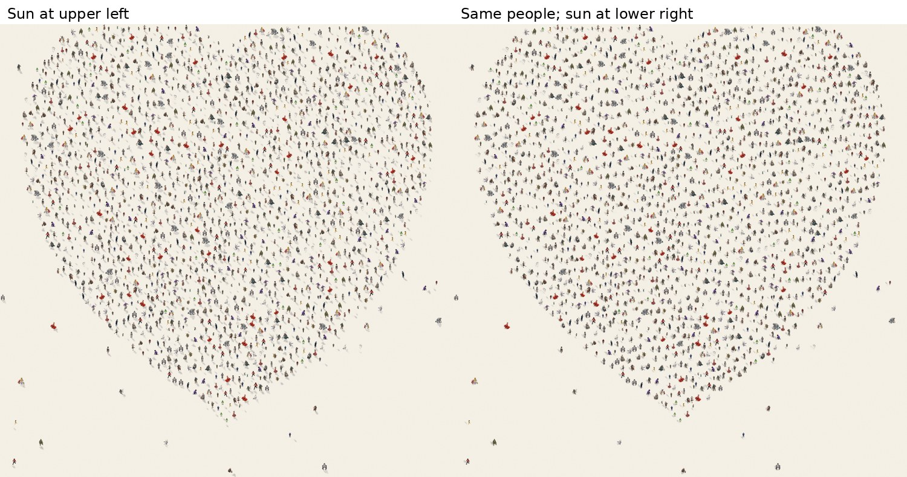
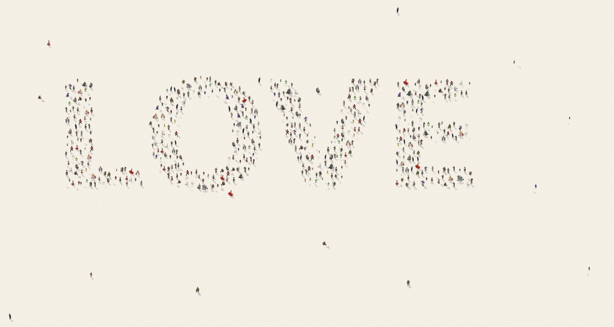

# CrowdCanvas

Turn portraits, lettering, logos and silhouettes into compositions made from
human PNG motifs. This is a **rendering prototype**, not a finished print service.

## Run on your Mac

Use Python 3.11–3.13. Open the **repository root** (the folder containing this
README and `app.py`) in VS Code, open its terminal, and run:

```bash
bash run.sh
```

Open http://localhost:8501. The script creates `.venv` if needed and installs
new requirements even when the environment already exists. The first background
removal downloads an approximately 176 MB model. Keep Terminal running.

`Source Code/` is an archived copy; the active app is in the root folder.

## What changed

The original renderer used independent random placements and a combined gamma /
selectivity exponent that erased midtones. It had no checks for overlapping
figures, used motifs with painted-in shadows, and rebuilt the composition for
each print resolution.

The new engine separates **composition** from **rendering**:

- Weighted Voronoi relaxation spaces out candidate locations according to the
  image's tones. A footprint check keeps actual human figures apart.
- Portrait mode also weights strong contours, such as glasses, eyes and mouths.
  Text mode preserves counters and gaps. Silhouette mode fills the subject shape.
- A request for more people cannot force them into lighter regions. When the
  requested figure size and spacing cannot fit, the actual count is reported.
- The same normalized positions, motif choices and sizes are reused for every
  export. Light, color and texture changes reuse that arrangement too.
- The sun compass controls direction; sun height controls shadow length.
  Keyboard arrows can adjust direction. Changing the finish refreshes a preview.
- Print presets and custom frames use exact width, height and DPI. Differently
  shaped frames contain the composition with blank margins, without stretching.
- PNG and TIFF downloads embed the selected print DPI and an sRGB profile.
  A 160-megapixel limit prevents unbounded export allocations.

The spacing approach is based on [Adrian Secord's Weighted Voronoi Stippling
(NPAR 2002)](https://www.cs.ubc.ca/labs/imager/tr/pdf/secord.2002b.pdf), with
additional footprint checks and portrait contour weighting.

## Visual examples

These examples use independently generated lettering and a heart silhouette.
The supplied Craig Alan artworks were used as visual references and are not
bundled into this app. Portrait comparisons are provided separately for review.





## Starting settings

Choose the input type first; its preset resets person size, count, tone contrast
and palette. Then adjust them for the specific image.

| Input | First adjustments |
| --- | --- |
| Portrait | Remove the background; use a closely framed, sharp photo. Ink with color accents increases contrast. Adjust tone contrast before increasing the crowd count. |
| Lettering or logo | Use clean dark-on-light or light-on-dark artwork. Turn off background removal. Reduce person size if strokes or interior spaces are narrow. |
| Object or heart | Use silhouette mode for a filled shape; use the general subject detector for objects. Choose original motif colors for colorful crowds. |

Generate a new preview after changes to composition or a manual mask. Print
exports use the displayed composition. Shuffle changes the arrangement seed.

## Motifs and quality limits

The existing collection has 41 source PNGs, including one almost blank extraction
artifact that is filtered out. Many motifs include opaque blue-gray ground
shadows. Automatic cleanup removes that color family and trims outside fringes
without modifying the source files. It can also remove pale blue clothing and
miss unusual shadow colors: inspect the motif gallery, or disable cleanup to
retain the original motifs and their fixed shadows.

For a dependable print product, replace those assets with shadow-free transparent
figures made from a consistent camera angle, with comparable detail and foot
placement. More pose and wardrobe variety will reduce visible repetition. A
larger raster export cannot recover detail absent from the motifs or source photo.

Dynamic shadows are approximate 2D silhouette projections attached to the feet;
they do not reconstruct a person's 3D geometry. Compare a close crop and a
physical proof print before treating an output as ready to sell. Portraits may
need mask touch-ups and per-image composition tuning.

## Checks

```bash
.venv/bin/python -m unittest discover -s tests -v
node tests/test_light_compass.cjs
```

Python checks cover deterministic composition, non-overlapping footprints,
letter counters, transparent inputs, shadow direction and attachment, physical
pixel sizing, embedded DPI, motif cleanup and a broken optional face detector.
The JavaScript check exercises compass handlers and message values with SVG
stubs; it is not a full browser test.

The app was also exercised with Streamlit AppTest through upload, preview,
lighting updates, A4 export, PNG/TIFF downloads, mask editor and mode presets.
The automated environment was Linux with Python 3.12; check the browser control
and final printed appearance on your Mac.
